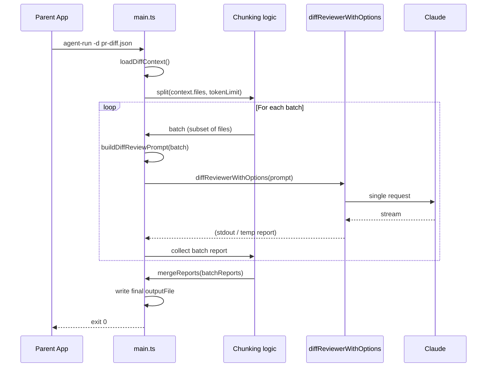

# PR Chunking and Large-PR Handling

Plan for handling PRs that exceed Claude's effective context limit (~180K tokens) in appsec-agent: implement optional chunking (batch scan + merge), with optional file filtering and graceful degradation, all inside this package so the parent app can keep calling a single agent-run invocation.

---

## Current behavior

- The **parent app** builds a single `DiffContext` JSON (PR metadata + `files[]` with hunks) and invokes appsec-agent once with `-d pr-diff.json`.
- **appsec-agent** ([src/main.ts](../src/main.ts)) loads the JSON, calls `formatDiffContextForPrompt(diffContext)` in [src/diff_context.ts](../src/diff_context.ts) to turn the entire diff into one markdown string, then passes that as the user prompt to `diffReviewerWithOptions()` in [src/agent_actions.ts](../src/agent_actions.ts). One LLM call, one report.
- There is **no token estimation or size limit** in the codebase; the full prompt is always sent. When the prompt exceeds the model's effective limit (~180K tokens for 200K context), the call fails.

All Claude models (Sonnet, Opus, Haiku) use the same 200K context window, so switching to Opus does not avoid the limit.

---

## Recommended direction: chunking + optional filtering and degradation

Implement **PR chunking** in appsec-agent so the parent app can keep a single invocation and the agent handles large PRs by batching files, scanning each batch, and merging results. Optionally add **file/directory filtering** (config or CLI) and **graceful degradation** (when even a single batch would be too large, scan a subset and report what was skipped).

| Approach | Where it lives | Effort | Outcome |
|----------|----------------|--------|----------|
| **1. Ask author to split PR** | Process | None | Immediate; no code change. |
| **2. PR chunking** | appsec-agent | Medium | Automatic batching, multiple LLM calls, merged report. |
| **3. File/dir filtering** | appsec-agent (or parent) | Low | Fewer files in diff context; can combine with chunking. |
| **4. Graceful degradation** | appsec-agent | Low–Medium | When over limit, scan subset + note skipped files. |

Recommendation: implement **2 (chunking)** as the main feature, and **4 (graceful degradation)** as a safety net when a single batch would still exceed the limit. Add **3 (filtering)** as an optional config/CLI so projects can exclude low-value paths (e.g. `src/services/server-side/analytics/*`) and reduce token use or batch count.

---

## Limits (no unbound chunking)

Chunking must be bounded so that PR diff mode does not effectively become a full-repository review. Apply these limits:

| Setting | Suggested default | Rationale |
|--------|--------------------|-----------|
| `diff_review_max_tokens_per_batch` | 150000 | Leaves headroom under ~180K effective limit. |
| `diff_review_max_batches` | **3** | Enough for large PRs (e.g. ~23 files × 3 ≈ 69 files max) without allowing unbounded runs. |
| `diff_review_max_files` (optional) | 50–80 | Hard cap on how many files are considered; rest are skipped with a note. |

Behavior when limits are hit:

- If the PR would need more than `max_batches` batches, run only the first N batches (N = `max_batches`). Treat remaining files as skipped: add a **"Skipped"** section in the merged report, e.g. *"PR exceeded batch limit (max N batches). Only the first M files were reviewed. Consider splitting the PR or using a full repository review."*
- If `max_files` is set and the diff has more files, only the first `max_files` files are included in batching; the rest are skipped with a similar note.

---

## Cost and usage tracking

API cost should be tracked and visible whether the run uses one call (1 trunk) or multiple batches (e.g. 3 trunks).

- **Current behavior (1 trunk)**: For a single PR scan, [src/agent_actions.ts](../src/agent_actions.ts) already prints cost when the SDK returns it: when the stream yields a `result` message with `total_cost_usd`, the agent logs e.g. `Cost: $0.0123`. (OpenAI failover path in [src/llm_query.ts](../src/llm_query.ts) computes cost from usage; Anthropic path relies on the SDK to populate `total_cost_usd` in the result.)
- **Chunked runs (e.g. 3 trunks)**: Without aggregation, each batch would print its own cost line. The implementation must:
  - **Collect** cost (and optionally input/output token counts if the SDK exposes them) from each batch’s result message.
  - **Aggregate** and report at the end:
    - Per-batch: e.g. log "Batch 1: $X.XX", "Batch 2: $X.XX", "Batch 3: $X.XX".
    - **Total**: log "Total API cost: $Y.YY" so there is a single number for the whole run.
  - Optionally include **total cost** (and token totals) in the merged report metadata (e.g. JSON: `meta.total_cost_usd`, `meta.batches`); that allows the parent app to parse cost from the report file if needed.

So API cost is tracked for both 1 trunk and 3 (or N) trunks, with a clear total for the invocation.

---

## Architecture (chunking flow)

- **Input**: One `DiffContext` (one `-d` file) as today.
- **Split**: Split `context.files` into batches such that each batch's prompt stays under a configurable token budget (e.g. 150K tokens to leave room for system prompt and output).
- **Per batch**: Build a `DiffContext`-like object with only that batch's files (reuse `formatDiffContextForPrompt`), same instructions and output format, but ask the agent to write the report for *this batch* to a **temporary file** (or return via a structured stream) so the runner can merge.
- **Merge**: Combine batch results into one report and write to the user-requested `outputFile`. Format-specific: JSON (merge arrays of findings), Markdown (concat sections with batch headers), etc.
- **Graceful degradation**: If the first batch alone exceeds the budget (e.g. one giant file), do not send the whole file; either split by hunks or include only the first N files and add a "Skipped X files due to size" section in the report.

---

## Implementation plan

**Principle: separate source files when possible.** Prefer dedicated modules for chunking, token estimation, and report merge so the feature is easy to find, test, and later rework or remove (e.g. if 1M-context models make chunking rare). Keep [main.ts](../src/main.ts) as a thin orchestrator that calls into these modules.

**Module layout (new or touched files):**

| File | Responsibility |
|------|-----------------|
| [src/diff_chunking.ts](../src/diff_chunking.ts) | Token estimation, file filtering, batching (respecting max_batches / max_files). |
| [src/diff_report_merge.ts](../src/diff_report_merge.ts) | Merge batch report files (JSON, Markdown, etc.) and optional cost/skipped metadata. |
| [src/main.ts](../src/main.ts) | Orchestration only: load diff, call chunking, run batches, collect cost, call merge, log total cost. |
| [src/__tests__/diff_chunking.test.ts](../src/__tests__/diff_chunking.test.ts), [src/__tests__/diff_report_merge.test.ts](../src/__tests__/diff_report_merge.test.ts) | Unit tests for the above. |

### 1. Token estimation

- **Location**: New file [src/diff_chunking.ts](../src/diff_chunking.ts) (or a small [src/diff_tokens.ts](../src/diff_tokens.ts) if you want token helpers isolated). Do not add chunking-specific helpers to `utils.ts` so the feature stays self-contained.
- Add a function to estimate token count from a string (e.g. `chars / 4` or use a lightweight tokenizer if the SDK exposes one).
- Use it to estimate the prompt size for a given subset of `DiffContext.files` by building the formatted string for that subset and counting tokens (or chars).

### 2. Chunking logic

- **Location**: Dedicated file [src/diff_chunking.ts](../src/diff_chunking.ts) (can share with token estimation above). Keep all batching and limit logic here, not in main.
- **Inputs**: `DiffContext`, `maxTokensPerBatch`, `maxBatches`, optional `maxFiles`, optional **file exclude list** (glob or path prefixes from config).
- **Steps**:
  - Optionally filter `context.files` by exclude patterns (option 3). If `maxFiles` is set, take only the first `maxFiles` files; treat the rest as skipped (caller will add them to the "Skipped" section).
  - Group files into batches so that for each batch, `estimateTokens(formatDiffContextForPrompt(batch)) + overhead` is below `maxTokensPerBatch`. Put whole files in a batch (do not split a file across batches).
  - Cap the number of batches at `maxBatches`: if more batches would be needed, only produce the first `maxBatches` batches; remaining files are considered skipped.
  - Return `DiffContext[]` (each with same metadata but different `files` and updated `totalFilesChanged` / totals for that batch), plus metadata for skipped files/batches so the merged report can include a "Skipped" section.

### 3. Config and CLI

- **Config** ([conf/appsec_agent.yaml](../conf/appsec_agent.yaml)): Under **`pr_reviewer.options`** (chunking is on by default for PR diff mode when using `pr_reviewer`; `code_reviewer` has no chunking defaults). Add:
  - `diff_review_max_tokens_per_batch` (e.g. 150000; 0 or omit = no chunking, send all in one shot).
  - `diff_review_max_batches` (e.g. 3; cap on number of batches per run; see Limits above).
  - `diff_review_max_files` (optional; e.g. 50–80; cap on number of files considered; rest skipped).
  - `diff_review_exclude_paths` (optional list of globs/paths to drop from `context.files` before batching).
- **CLI** ([bin/agent-run.ts](../bin/agent-run.ts)): Optional flags, e.g. `--diff-max-tokens <n>`, `--diff-max-batches <n>`, `--diff-max-files <n>`, `--diff-exclude <glob>` (repeatable), overriding config when set.

### 4. Report merge (separate module)

- **Location**: New file [src/diff_report_merge.ts](../src/diff_report_merge.ts). Keep merge logic out of main so it can be tested and reworked independently.
- **JSON**: Parse each batch JSON, combine findings arrays (and any metadata), write one JSON to `outputFile`. Include `meta.total_cost_usd` (and optionally `meta.batch_costs` / token counts) when chunking was used.
- **Markdown**: Concat with a short header per batch (e.g. "## Batch 1 (files X–Y)") and a final "Skipped" section if any files were dropped. Optionally append a line with total API cost for the run.
- Other formats (xml, csv, xlsx): define merge rules or keep "one report per batch" and write the first batch to `outputFile` and document that multi-batch mode may produce multiple files unless format supports merge.

### 5. main.ts diff-context path (orchestration only)

- **Keep main thin**: After `loadDiffContext()`, call into [src/diff_chunking.ts](../src/diff_chunking.ts) for batching and [src/diff_report_merge.ts](../src/diff_report_merge.ts) for merging; avoid inlining chunking or merge logic.
- After load and optional filtering:
  - If chunking is disabled or single-batch: keep current behavior (one `buildDiffReviewPrompt`, one `diffReviewerWithOptions`, write to `outputFile`).
  - If chunking is enabled and there are multiple batches (up to `max_batches`):
    - For each batch, build a prompt that (1) uses the batch's diff content and (2) instructs the agent to write the report for this batch to a **temp file** (e.g. `code_review_batch_1.json` in a temp dir).
    - Call `diffReviewerWithOptions(prompt, tmpSrcDir)` per batch; **collect** each batch’s `total_cost_usd` (and token usage if available) from the result message for aggregation.
    - Ensure the prompt specifies the temp output path (e.g. via a small change to `buildDiffReviewPrompt` to accept an optional output path override).
    - After all batches complete, call the **report-merge module** to merge batch report files and write the result to `outputFile`. Optionally add `meta.total_cost_usd` (and per-batch cost) to the merged report.
    - Log per-batch cost and **total API cost** (e.g. "Batch 1: $X.XX", "Batch 2: $X.XX", "Total: $Y.YY"). Delete temp files.
  - If the first batch is still over the limit (graceful degradation): either split by hunks (complex) or take a subset of files for the first batch, add a clear "Skipped N files (list) due to size limit" in the merged report.

### 6. Testing

- **Per-module tests**: Add [src/__tests__/diff_chunking.test.ts](../src/__tests__/diff_chunking.test.ts) for token estimation, batching (given N files and sizes, expect M batches, and respect `max_batches` / `max_files`), and filtering (exclude paths). Add [src/__tests__/diff_report_merge.test.ts](../src/__tests__/diff_report_merge.test.ts) for merge (JSON/Markdown) and cost metadata. Test cost aggregation (e.g. mock result messages with `total_cost_usd`, assert total is summed and logged) in the chunking or main test as appropriate.
- Integration: use a large fixture `pr-diff.json` (or generate one with many files) and run with a low `max_tokens_per_batch` to assert multiple batches, a single merged output file, and that total cost is printed.

### 7. Documentation

- README: document chunking (enabled by config/cli), exclude patterns, and that merged report may include a "Skipped" section when over limit.
- CHANGELOG: new options and behavior.

---

## Clarifications and alternatives

- **Who chunks**: Chunking in appsec-agent keeps the parent app simple (one `-d` file, one invocation). Alternatively, the parent could split the PR into multiple JSON files and call `agent-run` multiple times, then merge reports itself; that would duplicate merge logic and require parent changes.
- **Opus**: Same 200K limit; no need to switch model for context. Opus can still be used for quality if desired.
- **Option 1**: Continue to ask authors to split very large PRs when feasible; chunking is for when that's not possible or not done.
- **Claude Opus 4.6 and 1M context (rollback / rework)**: Claude Opus 4.6 offers a **1 million token context window** in beta (extended context above 200K may require beta access and has different pricing). If that becomes the default or widely available, very large PRs could be reviewed in a single call and chunking may no longer be necessary. Keep this in mind when implementing: design chunking so it can be **rolled back or reworked** (e.g. make it config-driven, avoid hard dependencies in the main flow) if 1M-context models make multi-batch runs rare. Document the decision so future maintainers can revisit and simplify or remove the feature.

---

## Summary

- Implement **PR chunking** in appsec-agent: split `DiffContext.files` by token budget, run one LLM call per batch (up to **max_batches**, e.g. 3), write each batch to a temp report, then merge into a single `outputFile`.
- **Separate source files**: Chunking and token logic in [src/diff_chunking.ts](../src/diff_chunking.ts), report merge in [src/diff_report_merge.ts](../src/diff_report_merge.ts); [main.ts](../src/main.ts) orchestrates only. Makes the feature easy to track, test, and later rework or remove.
- Add **limits**: `max_batches` (no unbound chunking), optional `max_files`; when exceeded, only the first N batches / M files are reviewed and a "Skipped" section is added to the report.
- Add **token estimation** and **config/CLI** for `max_tokens_per_batch`, `max_batches`, optional `max_files`, and optional `exclude_paths`.
- **Cost tracking**: For both 1 trunk and chunked runs, aggregate and log total API cost (per-batch + total); optionally include total cost in merged report metadata.
- Add **graceful degradation** when a single batch would still exceed the limit (subset of files + "Skipped" in report).
- No change to the parent app's contract: single `-d pr-diff.json` call; agent handles size internally.
