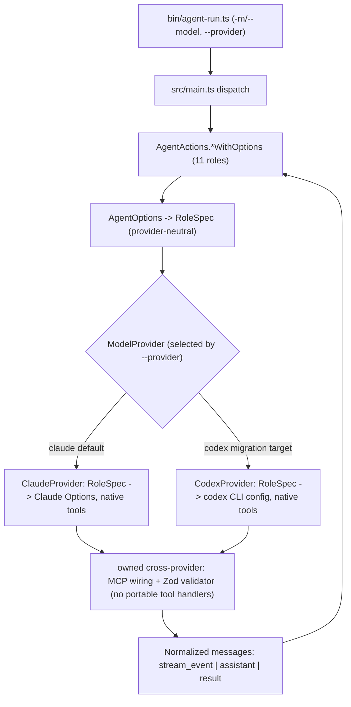

# Plan: Pluggable Model Providers and Codex Migration

Status: Draft for review
Author: drafted for Sam Li
Scope: `appsec-agent` package only (parent app `ai-threat-modeler` consumes it unchanged)

## Goal

Let the agent switch the underlying model/runtime long-term without rewriting role logic, and migrate toward Codex (`@openai/codex-sdk`) as the target provider. Today every role is hard-bound to the Claude Agent SDK. We introduce a single seam - an abstract `ModelProvider` class - where `claude` (current default) and `codex` (migration target) are interchangeable, while keeping the output contract the parent app depends on. `cursor` is explicitly deferred and not in scope for this plan.

Direction: Codex is the provider we intend to migrate to. The abstraction is the safe path to get there - Claude stays the default and reference implementation during the transition so we can run Codex opt-in, compare on real scans, and only flip the default once Codex reaches parity.

Non-goal: a big-bang switch that removes Claude in one step. Promotion of Codex to default is the final phase, gated on parity evidence.

The Anthropic to OpenAI failover was never deployed, so there is no backward-compatibility constraint on it. Rather than carry dead code through the migration, it is removed up front in Phase 1, which also simplifies `ClaudeProvider` and deletes the only consumer of the `write_file` custom handler.

## Where we are today

All eleven role methods in [`src/agent_actions.ts`](src/agent_actions.ts) funnel through one call:

```
for await (const message of llmQuery({ prompt, options })) { ... }
```

- `options` is a Claude SDK `Options` object built by the `AgentOptions` class in [`src/agent_options.ts`](src/agent_options.ts) (constructor takes a `model` string, default `opus`).
- [`src/llm_query.ts`](src/llm_query.ts) runs Anthropic, and on failure optionally runs a degraded single-turn OpenAI shim (`openai` chat completions + one `write_file` tool). This failover path was never deployed; it is dead code removed in Phase 1.
- Structured output is enforced via Claude SDK `outputFormat.json_schema`; callers read `result.structured_output` (see the repeated block around [`src/agent_actions.ts`](src/agent_actions.ts) line 317).
- The CLI flag `-m/--model` in [`bin/agent-run.ts`](bin/agent-run.ts) validates Claude families only (`sonnet`, `opus`, `haiku`, `claude-*`, version prefixes).
- MCP is wired as `mcp__<server>__*` HTTP tools via `attachMcpServerToOptions` in [`src/agent_options.ts`](src/agent_options.ts).

`llmQuery({ prompt, options })` is the natural and only chokepoint. Everything else is built on the normalized message shape it already emits (`stream_event` / `assistant` / `result`).

## Target architecture

Introduce an abstract `ModelProvider` class as the seam. Role builders stop emitting Claude-shaped `Options` and instead emit a provider-neutral `RoleSpec` (capabilities + output schema + prompt). Each `ModelProvider` subclass maps that `RoleSpec` to its native tools, runs the model, and normalizes the stream back to the existing `QueryMessage` shape so `agent_actions.ts` consumers are unaffected.

Two design decisions confirmed for this plan:
- Tool model is minimize-custom-handlers: capabilities map to each provider's native tools. We do not port portable handlers. `write_file` is deleted with the failover path (Phase 1), the `Bash` security policy is re-expressed through each provider's native sandbox/approval mechanism, and structured output relies on post-run validation. The only thing we own across providers is the MCP wiring and the shared Zod validator.
- Sequencing is spike-first, not up-front. `RoleSpec` is not designed against Claude alone. We prove it on one role end-to-end across both providers, then migrate the remaining roles to the validated shape. This lets the second provider inform the abstraction instead of guessing.



### The class

```typescript
// src/providers/types.ts
export interface RoleSpec {
  systemPrompt: string;
  maxTurns: number;
  // Claude has TWO Options shapes that RoleSpec must reproduce:
  //  - top-level systemPrompt + maxTurns (simple_query_agent: no agents, no tools)
  //  - a named subagent agents[agentName] with its own tool whitelist + model (reviewers)
  // `agentName` set => ClaudeProvider emits the subagent shape; unset => top-level.
  agentName?: string;
  capabilities: { read?: boolean; write?: boolean; grep?: boolean; shell?: boolean };
  noTools?: boolean;                                   // maps AgentArgs.no_tools
  permissionMode?: 'bypassPermissions' | 'default';   // reviewers use bypassPermissions
  mcp?: { url: string; name: string; bearer?: string; toolNames: string[] };
  outputSchema?: object;   // provider enforces (Claude) or post-validates (Codex)
  model?: string;          // provider-appropriate id; default resolved per provider
}

export abstract class ModelProvider {
  abstract readonly provider: 'claude' | 'codex';
  abstract run(spec: RoleSpec, prompt: string): AsyncGenerator<QueryMessage>;

  // shared, inherited by all providers
  protected costLine(usd: number): string { /* "Cost: $X.XXXX" for parseAgentMetrics */ }
}
```

`QueryMessage` is the existing union already exported from [`src/llm_query.ts`](src/llm_query.ts) (`stream_event`, `assistant`, `result`, passthrough). Keeping it as the provider output means `agent_actions.ts`'s message-handling loops do not change.

Normalized `result` contract (currently loose - `agent_actions.ts` reads it via `as any`). The plan tightens `ResultMessage` so every provider must populate it explicitly, because roles depend on more than cost:
- `structured_output` - read by all reporting roles.
- `usage: { input_tokens, output_tokens }` - `learnedGuidanceSynthesizerWithOptions` prints `Tokens input:` / `Tokens output:` lines the parent's `parseAgentMetrics` consumes.
- `total_cost_usd` - the `Cost: $X.XXXX` line; also threaded per-verdict as `cost_usd_estimate` by `fpAdversaryWithOptions`.

`CodexProvider` must produce all three (token counts and cost from Codex usage; `structured_output` from the validator), not just the cost line.

The permission machinery on `AgentOptions` (`permissionMode: 'bypassPermissions'`, `toolPermissionCallback`, `toolUsageLog`) is Claude-runtime behavior and moves into `ClaudeProvider`; it is not part of the neutral `RoleSpec` beyond the `permissionMode` hint.

This `run(spec: RoleSpec, ...)` signature is the target. Per the spike-first sequencing below, `ClaudeProvider` initially ships with a transitional `run(options: Options, ...)` shim (Phase 1) and only adopts `RoleSpec` once it is validated against Codex (Phase 3).

### Tool model (minimize custom handlers)

The hardest part of a shared tool layer is that custom handlers do not have a portable signature across Claude's custom-tool channel, Codex `--config`, and OpenAI `tool_calls`. We avoid that problem by not sharing handlers. Each existing custom tool is reclassified:

- Built-in tools (Read/Grep/Write/Shell) are declared by capability flags on `RoleSpec` and map to each provider's native tool set. We do not reimplement them.
- `write_file` (`WRITE_FILE_TOOL` + `executeWriteToolCalls` in `src/openai_tools.ts`) existed only for the OpenAI failover shim. Since failover is removed in Phase 1, this handler is deleted outright and never reaches Codex (Codex has native write anyway).
- `Bash` ([`src/tools/bash_tool.ts`](src/tools/bash_tool.ts)) is `qa_verifier`-only and really encodes security policy (the `DANGEROUS_PATTERNS` filter, `NODE_ENV=test`/`CI=true`). That policy is re-expressed through each provider's native shell guardrails - Claude's permission callback, Codex's sandbox + approval config - rather than as a shared handler. The shell capability itself maps to the provider's native shell.
- MCP (`mcp__<server>__*`) is provider-specific config, not a handler. `ClaudeProvider` keeps `attachMcpServerToOptions`; `CodexProvider` wires the same parent-app server through Codex's MCP config.
- Structured output uses post-run Zod validation against [`src/schemas/`](src/schemas) (see next section), so no cross-provider "submit report" tool handler is required.

Net: the only things we own across providers are the MCP wiring and the shared validator. There is no portable custom-handler registry to maintain.

### Provider selection

- New env `AGENT_PROVIDER` (default `claude`) and CLI flag `--provider <claude|codex>`.
- Keep `-m/--model` for the per-provider model id. Validation AND the default become provider-aware: the current `'opus'` default is Claude-only and is invalid for `codex`, so each provider resolves its own default model.
- No failover. The never-deployed Anthropic to OpenAI failover is removed in Phase 1, so there is no failover asymmetry between providers. If a provider-level fallback is ever wanted, `--provider claude` is the explicit escape hatch.

## The hard part: output contract parity

Each role depends on enforced structured JSON (`result.structured_output`). Codex parity is mostly about reproducing that contract:

- Claude: native `outputFormat.json_schema` (already done).
- Codex: `@openai/codex-sdk` wraps the `codex` CLI and exchanges JSONL events over stdio; the final turn surfaces assistant text, not a schema-enforced object. `CodexProvider` produces `structured_output` from `RoleSpec.outputSchema` by post-run parsing the final text and validating it against the existing Zod/JSON schemas in [`src/schemas/`](src/schemas). We deliberately avoid a custom "submit report" tool (it would reintroduce the per-provider handler problem); a prompt instruction to emit JSON plus strict post-run validation is the simpler path.

This validation helper is the main new work for the Codex migration. It is shared (not duplicated per provider) and reuses the schemas the parent app already consumes, so a malformed Codex completion fails closed exactly like today's empty-report fallback in [`src/main.ts`](src/main.ts).

### Codex SDK specifics to design around

- Spawns the `codex` CLI; needs Node 18+ and the `@openai/codex` binary resolvable in the parent Docker image (another native dependency alongside Claude's bundled binary).
- Auth via `CODEX_API_KEY`; custom endpoints via `baseUrl` (passed as `--config openai_base_url=...`).
- Working directory must be a git repo, or pass `skipGitRepoCheck`. Our scan copies `src_dir` into a temp dir (see `validateAndCopySrcDir` in [`src/main.ts`](src/main.ts)) - that temp dir is usually not a git repo, so `skipGitRepoCheck` is the expected setting.
- `runStreamed()` yields structured events (tool calls, streaming text, file-change notifications) - this is what `CodexProvider` adapts into `QueryMessage`. `run()` only buffers the final turn.
- Threads persist in `~/.codex/sessions` (global) and the SDK spawns a CLI subprocess. The parent app runs scans concurrently (see [`src/__tests__/concurrency.test.ts`](src/__tests__/concurrency.test.ts)), so each run must isolate Codex state - distinct `CODEX_HOME` / cwd via the codex-sdk `env` parameter - to avoid collisions. `resumeThread()` is out of scope (runs are single-shot per role).
- Cost/usage: confirm Codex emits token usage we can turn into the `Cost: $X.XXXX` line the parent's `parseAgentMetrics` consumes.

## Phased rollout

Spike-first: prove the seam on one role across both providers before migrating the rest. The transient cost is that `ClaudeProvider` briefly accepts two input shapes (raw Claude `Options` for not-yet-migrated roles, `RoleSpec` for the spiked role). That dual-path is bounded and removed in Phase 4.

### Phase 0 - Decision doc and scoping (this document)
No code. Decisions recorded: migrate toward Codex (`@openai/codex-sdk`); `cursor` deferred; minimize-custom-handlers tool model; spike-first sequencing; spike role is `threat_modeler` (JSON mode), with MCP wiring deferred to the first MCP-aware role in Phase 4; the never-deployed failover is removed in Phase 1 (no backward-compat constraint).

Go/no-go gates (must be answered before Phase 2 invests in Codex - a "no" on either changes or kills the migration):
- Can the parent Docker image carry the `codex` CLI on linux/amd64 and arm64?
- Billing/credential model: standardize on `CODEX_API_KEY`, or keep customer-supplied `ANTHROPIC_API_KEY` as primary? This affects whether Codex can ever be the default for BYO-key customers.

### Phase 1 - Remove dead failover, then extract `ModelProvider` + `ClaudeProvider` (no behavior change, no RoleSpec yet)
- Remove the never-deployed failover first: delete `openaiFallbackStream` and the `FAILOVER_ENABLED` / `OPENAI_*` handling from [`src/llm_query.ts`](src/llm_query.ts), delete `src/openai_tools.ts` (the `write_file` handler), drop the related flags in [`bin/agent-run.ts`](bin/agent-run.ts) (`-F/--failover`, `-K/--openai-api-key`, `-U/--openai-base-url`), remove the `openai` dependency from [`package.json`](package.json), and delete the failover tests in [`src/__tests__/llm_query.test.ts`](src/__tests__/llm_query.test.ts) and the failover env cases in [`src/__tests__/agent-run.test.ts`](src/__tests__/agent-run.test.ts). Also prune the README "LLM failover" section.
- Add `src/providers/types.ts` (abstract `ModelProvider`, reuse `QueryMessage`).
- Add `ClaudeProvider` that initially accepts today's Claude `Options` and runs the Anthropic path (now the only path) from [`src/llm_query.ts`](src/llm_query.ts).
- Route `agent_actions.ts` role methods through `claudeProvider.run(options, prompt)` instead of `llmQuery({ prompt, options })`. Message-handling loops stay identical.
- Acceptance: full suite green; Claude output byte-for-byte equivalent (failover removal changes only the dead path). No `RoleSpec` is designed yet.

### Phase 2 - Provider plumbing + Codex dependency
- Add `--provider` flag in [`bin/agent-run.ts`](bin/agent-run.ts) and `AGENT_PROVIDER` env; make `-m/--model` validation provider-aware; default remains `claude`.
- Add `@openai/codex-sdk` to [`package.json`](package.json); confirm the `codex` CLI resolves in CI and the parent Docker image (linux/amd64 + arm64).
- Add the shared post-run structured-output validator (Zod against existing [`src/schemas/`](src/schemas)).

### Phase 3 - Spike `CodexProvider` on ONE role; let `RoleSpec` emerge
- Spike role is `threat_modeler` (JSON output mode). It is chosen over `simple_query_agent` (an interactive REPL exercising neither structured output nor tools) because it exercises most hard fields at once: a large structured-output schema (`THREAT_MODEL_REPORT_SCHEMA` - DFD, STRIDE threats, risk registry, a strong stress test for Codex post-run validation), the `agents['threat-modeler']` subagent shape, `permissionMode: 'bypassPermissions'`, and Read/Grep over the copied `src_dir`.
- Known coverage gap: `threat_modeler` is NOT MCP-aware (`getThreatModelerOptions` takes no MCP params), so this spike does not exercise the `RoleSpec.mcp` field or the Codex MCP wiring. That validation moves to the first MCP-aware role in Phase 4 (`code_reviewer` / `pr_reviewer`). The plan accepts that `RoleSpec.mcp` stays unproven until then; flag it so Phase 4 does not assume MCP "just works".
- Note: `threat_modeler`'s markdown mode adds a `Graphviz` tool beyond Read/Grep/Write. The spike uses JSON mode (Read/Grep only); modeling `Graphviz` as a capability is a Phase 4 item if Codex parity for markdown output is required.
- Implement `src/providers/codex_provider.ts` for that role: map the role's needs to Codex native tools, adapt `runStreamed()` events to `QueryMessage`, set `skipGitRepoCheck`, isolate `CODEX_HOME`, and produce `structured_output` + `usage` + `total_cost_usd` via the shared validator and Codex usage.
- Define `RoleSpec` here, derived from the real tension between Claude and Codex for this role - including the subagent-vs-top-level shape, `permissionMode`, the output schema, and the normalized `result` fields. The `mcp` field is added (un-exercised) for the Phase 4 MCP role.
- Update `ClaudeProvider` to consume `RoleSpec` for this role too (proving the shape round-trips back to Claude `Options` byte-for-byte).

Spike acceptance checklist:
- Read/Grep over the copied `src_dir` works.
- Parent app can consume the threat-model report JSON reliably (schema-valid against `THREAT_MODEL_REPORT_SCHEMA`).
- `Cost: $X.XXXX` AND `Tokens input:` / `Tokens output:` lines emitted for the parent's `parseAgentMetrics`.
- Builds in the parent Docker image on linux/amd64 and arm64.
- Two parallel scans do not collide (isolated `CODEX_HOME` / cwd).
- (Deferred to Phase 4) MCP tools (`queryFindingsHistory`, etc.) callable during a run on the first MCP-aware role.

### Phase 4 - Migrate remaining roles to the validated `RoleSpec`
- Do the first MCP-aware role (`pr_reviewer` / `code_reviewer`) first, since it is what actually exercises `RoleSpec.mcp` and the Codex MCP wiring that the Phase 3 spike could not. Treat this as a second mini-spike: wire MCP through Codex config and confirm `queryFindingsHistory` et al. are callable before converting the rest.
- Convert the other builders in [`src/agent_options.ts`](src/agent_options.ts) (`getCodeReviewerOptions`, `getDiffReviewerOptions`, the adversary/validator/fixer roles, `simple_query_agent`) to emit `RoleSpec`; model the `Graphviz` capability if markdown threat-model parity is required.
- Implement each in `CodexProvider`; remove the transient `Options`-accepting path from `ClaudeProvider`.
- Acceptance: full suite green including [`src/__tests__/agent_options.test.ts`](src/__tests__/agent_options.test.ts) and the migrated MCP e2e tests; Claude output stays byte-for-byte equivalent.

### Phase 5 - Roll Codex out (opt-in) and compare
- Ship Codex as opt-in (`--provider codex` / `AGENT_PROVIDER=codex`); Claude stays the default.
- Run Codex and Claude side by side on real scans; compare report quality, cost, and latency.

### Phase 6 - Flip the default to Codex (gated)
- Only when Codex reaches parity on the checklist and side-by-side comparison: change the default `AGENT_PROVIDER` to `codex`.
- Keep `--provider claude` available as the explicit fallback. (Failover was already removed in Phase 1.)

## Testing strategy

Existing tests fall in two buckets: unit tests in `src/__tests__/` that mock the Claude SDK, and six e2e wiring tests in `e2e/*.e2e.test.ts` that run with no live LLM and assert on the Claude `Options` shape (e.g. `e2e/pr_reviewer_mcp.e2e.test.ts` asserts `Options.mcpServers` and the `['Read','Grep','Write']` whitelist via `buildMcpInternalToolNames`). Because those e2e tests assert on `Options` internals, they are a migration item in Phases 3-4, not "unchanged".

Two cross-cutting requirements:
- CI stays mock-only. `@openai/codex-sdk` spawns the `codex` CLI; CI mocks it the same way `@anthropic-ai/claude-agent-sdk` is mocked today, so no `CODEX_API_KEY` or network is needed for the default suite.
- Live-LLM e2e is gated and out of default CI. A live Codex smoke run is opt-in behind an env flag (e.g. `RUN_LIVE_CODEX=1`); the side-by-side Claude-vs-Codex comparison in Phase 5 is an eval harness, not a pass/fail CI gate, and runs out-of-band.

Golden parity harness (the mechanism behind "byte-for-byte equivalent"): snapshot each role's Claude `Options` before the refactor, then assert `ClaudeProvider` reproduces the identical `Options` from `RoleSpec` after. This is what keeps the existing e2e assertions meaningful - they move to the `RoleSpec -> ClaudeProvider -> Options` boundary rather than being deleted.

Per-phase test additions:
- Phase 1: delete the failover tests (`llm_query.test.ts` failover cases, `agent-run.test.ts` `FAILOVER_ENABLED` / `OPENAI_*` cases); add `ClaudeProvider` wrapper unit tests; remaining [`src/__tests__/agent_actions.test.ts`](src/__tests__/agent_actions.test.ts) cases pass unchanged (provider is a pass-through shim).
- Phase 2: `--provider` / `AGENT_PROVIDER` selection tests (the env-wiring pattern the deleted `FAILOVER_ENABLED` cases used is a good template); structured-output validator unit tests - valid JSON passes through, malformed fails closed to the empty-report fallback in [`src/main.ts`](src/main.ts).
- Phase 3: golden parity test for `threat_modeler` (`RoleSpec -> ClaudeProvider -> Options` reproduces the historic shape, including the `THREAT_MODEL_REPORT_SCHEMA` `outputFormat`); `CodexProvider` unit test (`RoleSpec` -> codex config + native-tool selection + `skipGitRepoCheck`); Codex stream-adapter test (fixture `runStreamed()` JSONL events -> normalized `QueryMessage` + `Cost:`/token lines); a Codex e2e test for `threat_modeler` with `@openai/codex-sdk` mocked, asserting schema-valid `structured_output` via the validator. (No MCP assertions here - threat_modeler has none.)
- Phase 4: MCP first - migrate `e2e/pr_reviewer_mcp.e2e.test.ts` (and the other `pr_reviewer_*` / `*_adversary` MCP e2e files) and the `Options`-shaped assertions in [`src/__tests__/agent_options.test.ts`](src/__tests__/agent_options.test.ts) / [`src/__tests__/agent_options.mcp.test.ts`](src/__tests__/agent_options.mcp.test.ts) to the provider boundary, and add the Codex MCP wiring e2e that the spike deferred. Then extend golden parity + `CodexProvider` coverage to all remaining roles.
- Phases 5-6: optional gated live-Codex smoke e2e; out-of-band comparison harness for quality/cost/latency.

## Provider comparison (for context)

- Claude Agent SDK (today): full parity, native JSON schema, MCP wired, production. Stays the default until Codex reaches parity.
- `@openai/codex-sdk` (migration target): CLI-wrapper agent over stdio JSONL, OpenAI-ecosystem billing (`CODEX_API_KEY`), `runStreamed()` structured events to adapt, needs a structured-output strategy + MCP re-wire + the `codex` CLI in the image. Chosen as the provider we migrate to.
- `@cursor/sdk` (Composer): deferred, out of scope for this plan.

## Risks

- Output contract drift: Codex cannot enforce JSON schema, so malformed reports could reach the parent app. Mitigated by the shared Zod validation layer and fail-closed empty-report fallbacks already present in [`src/main.ts`](src/main.ts).
- Operational footprint: the `codex` CLI is a new native dependency in the parent Docker image (linux/amd64 + arm64).
- Billing/credentials: Codex introduces `CODEX_API_KEY` as a second key path for parent-app customers who currently bring their own `ANTHROPIC_API_KEY`.
- Git-repo requirement: Codex expects a git working dir; our temp scan dir is not one, so `skipGitRepoCheck` must be set and tested.
- CLI/version coupling: `@openai/codex-sdk` is pinned to a matching `codex` CLI version; treat upgrades as a coordinated package-level change (same discipline as the Claude SDK pin).
- Transient dual-path: spike-first means `ClaudeProvider` briefly accepts both raw Claude `Options` (un-migrated roles) and `RoleSpec` (spiked role) between Phase 3 and Phase 4. Bounded and explicitly removed at the end of Phase 4; gate that cleanup so the two shapes do not become permanent.
- Shell security policy divergence: the `Bash` dangerous-pattern policy must be re-expressed in each provider's native mechanism (Claude permission callback, Codex sandbox + approval) rather than shared. Verify Codex's sandbox actually blocks the same patterns the qa_verifier filter does before relying on it.
- Concurrent-run collision (Codex): unlike the Claude SDK, Codex spawns a CLI and uses global `~/.codex` state. Parallel scans in one container can clobber each other. Must isolate `CODEX_HOME` / cwd per run; this is also a spike acceptance item and is covered by the existing concurrency test pattern.
- `RoleSpec` must reproduce two Claude `Options` shapes (top-level vs subagent) plus `permissionMode` and the normalized `result` fields (`structured_output`, `usage`, `total_cost_usd`). Under-modeling any of these breaks golden parity. The `threat_modeler` spike exercises the subagent shape, `permissionMode`, the output schema, and the result fields - but NOT `RoleSpec.mcp` (threat_modeler is not MCP-aware) and not the `Graphviz` capability. Those two are first validated in Phase 4 on the first MCP-aware role; until then they are designed but unproven.
- Public-API / semver: [`src/index.ts`](src/index.ts) exports `AgentActions` and `AgentOptions`. If any consumer uses this as a library (not just the `agent-run` CLI), signature changes are breaking. Confirm the parent app consumes via CLI (argv + stdout + report file) only; bump the package version and add a CHANGELOG entry per repo convention.

## Files in scope

- New: `src/providers/types.ts` (`ModelProvider`, later `RoleSpec`), `src/providers/claude_provider.ts`, `src/providers/codex_provider.ts`, shared post-run structured-output validator.
- Remove (Phase 1): `src/openai_tools.ts` and the failover logic in [`src/llm_query.ts`](src/llm_query.ts); the `-F/--failover`, `-K/--openai-api-key`, `-U/--openai-base-url` flags in [`bin/agent-run.ts`](bin/agent-run.ts); the `openai` dependency in [`package.json`](package.json); the README failover section; and the failover tests. Version bump + CHANGELOG entry.
- Edit (Phase 1): [`src/agent_actions.ts`](src/agent_actions.ts) (route through `claudeProvider.run`), [`src/llm_query.ts`](src/llm_query.ts) (Anthropic-only path into `ClaudeProvider`).
- Edit (Phase 2): [`bin/agent-run.ts`](bin/agent-run.ts) (`--provider`, provider-aware model validation + default), [`package.json`](package.json) (`@openai/codex-sdk`).
- Edit (Phases 3-4): [`src/agent_options.ts`](src/agent_options.ts) (builders emit `RoleSpec`, spiked role first then the rest).
- Tests (Phases 1-4): new `ClaudeProvider` / `CodexProvider` / validator / stream-adapter unit tests, golden-parity harness, `--provider` selection cases in [`src/__tests__/agent-run.test.ts`](src/__tests__/agent-run.test.ts); migrate the `Options`-shaped assertions in [`src/__tests__/agent_options.test.ts`](src/__tests__/agent_options.test.ts), [`src/__tests__/agent_options.mcp.test.ts`](src/__tests__/agent_options.mcp.test.ts), and the six `e2e/*.e2e.test.ts` files to the provider boundary; add a Codex e2e wiring test. CI mocks `@openai/codex-sdk`.
- Verify (Phase 0/1): [`src/index.ts`](src/index.ts) public exports - confirm parent app uses the CLI only before changing `AgentActions` / `AgentOptions` signatures.
- Reused as-is: [`src/tools/bash_tool.ts`](src/tools/bash_tool.ts) (policy reference for the qa_verifier shell capability), [`src/schemas/`](src/schemas), parent-app contract (unchanged).
